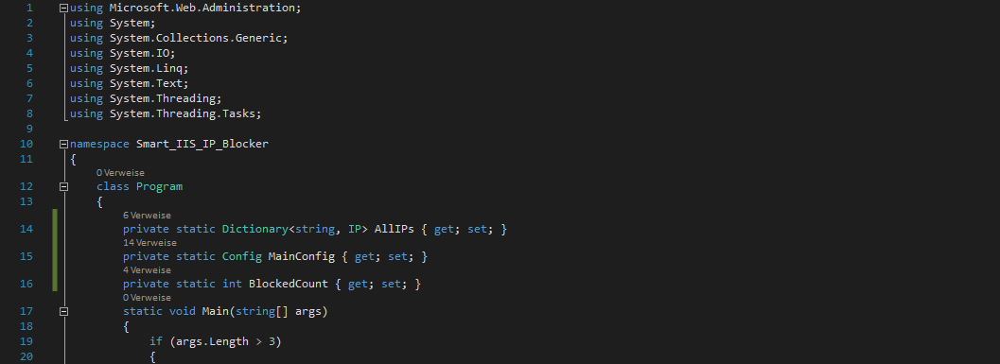

# IIS Limiter  

  

  
##Startparameter  
###-config="Path"  
(Plicht)Hier muss der Pfad zur Configdatei angegeben werden.  
###-log="Path"  
(Plicht)Hier muss der Pfad zur zukünftigen Log Datei angegeben werden.  
###-iptable="Path"  
(Plicht)Hier muss der Pfad zur zukünftigen IP-Tabellen-Datei angegeben werden, die die schlechten IPs enthalten wird.  
###-logroot="Path"  
(Plicht)Hier muss der Pfad, in denen sich die W3C Logs befinden, angegeben werden.  
###-checkinterval=00:00:00  
(Optional)Hier muss man angeben in welchen Intervall das Tool die Logs auf schlechte IPs überprüfen soll. 10 Sekunden (00:00:10) ist standard.  
  
##IIS Einstellungen  
###Protokollierung  
Format=W3C  
Codierung=UTF-8  
Protokolldateirollover/Zeitplan=Täglich  
###Einschränkungen für IP-Adressen und Domänen  
Featureeinstellungen bearbeiten/Aktionstyp verweigern=Verboten  
Das Feature "Einschränkungen für IP-Adressen und Domänen"  muss installiert sein.  
  
##Configeinträge (Beispiel)  
TriggerLevel=2  
TriggerCodes=401,403,404,405,406,412,500,501,502  
TriggerLogAgeInDays=2  
TriggerHitPoints=5  
TriggerAlwaysThisAgent=WEBDAV,urllib,curl,MainDeployer,censys.io,python,PycURL,curl,-,Morfeus,ZmEu,scan,WhatsApp,VLC,apache  
TriggerAtTransferredSize=53687091200  
TriggerAtTransferredSizePeriod=90  
Websites=Default Web Site  
  
1. TriggerLevel =   
	1: Zählt immer ein TriggerHitPoint hoch, wenn irgend etwas zu einem TriggerCode führte(Triggert mit den meisten Falschmeldungen)  
	2: Zählt nur dann ein TriggerHitPoint hoch, wenn der Zugriff auf ein nicht existierenden Ordner oder Datei ohne Endung zu einem TriggerCode führte(Triggert seltener, aber dafür gezielter bei Schnüffler)  
	3: Zählt nur dann ein TriggerHitPoint hoch, wenn der Zugriff auf ein nicht existierenden Ordner zu einem TriggerCode führte(Triggert noch seltener, meistens im Falle von falschen DNS Verweise)  
2. TriggerCodes = Nur bei deisen HTTP Fehler Codes wird getriggert.  
3. TriggerLogAgeInDays = Alle Logeinträge, die bis zu x Tage zurück gehen werden als Quelldaten für den Trigger genutzt.  
4. TriggerHitPoints = Wenn die selbe IP x Mal beim definierten Triggerlevel ein Fehlercode wirft, dann wird diese IP blockiert und in die IP Tabelle eingetragen.  
5. TriggerAlwaysThisAgent = Wenn der User-Agent WEBDAV oder ... beinhaltet, dann wird sofort beim ersten Versuch unabhängig vom Fehlercode die IP blockiert.  
6. TriggerAtTransferredSize = Wenn eine IP so viele Bytes(50GB in diesem Beispiel) im angegebenen Zeitfenster schon heruntergeladen hat, dann wird sie blockiert.  
7. TriggerAtTransferredSizePeriod = Die Menge an Daten, die von einer IP heruntergeladen wurde, wird in einem Zeitraum von x Tagen rückwirkend überwacht.  
8. Websites = Die IP's werden für die hier angegebenen Webseiten geblockt.  
  
##Inhalt  
Hier finden Sie den Sourcecode für das Programm.  
  
##Zweck  
Die meisten DoS oder DDoS Attacken werden heutzutage von den Server-Provider schnell erkannt und auf die ein oder andere Weise automatisch unterbrochen. Schnüffel-Attacken, also die Attacken, die gezielt nach einem Schwachpunkt am Webserver suchen, werden hingegen sogut wie nie erkannt, sodass man entweder sehr viel Geld für professionelle Software ausgeben oder sehr viel Geduld für das Lesen der Logs haben muss, um die IP's der Schnüffler auf die schwarze Liste zu setzen. Bei solchen Schnüffel Aktionen werden gleich mehrere Dutzend Ordner, wie webdav oder phpMyAdmin, abgeklopft, um darüber eine Sicherheitslücke zu finden und eine Attacke zu starten.  
  
Wenn man große Dateien im Gigabyte Bereich anbietet, dann wird man das eine oder andere Mal gesehen haben, dass es Zombie-Server gibt, die einem den Server-Traffic-Volumen, den es heutzutage in fast jeden Vertrag gibt, ohne irgend ein Sinn leer saugen, da sie nicht wie ein Normaler Webseitenbesucher die Datei ein paar Mal herunterladen, sondern gleich mehrere hundert Mal, sodass der Trafficvolumen des eigenen Servers noch vor der ersten Woche des Monats geleehrt wird. Wenn man Instanzen in der Cloud verwendet, dann kann das auch richtig ins Geld gehen, wenn man nicht aufpasst, da dort meistens pro Megabyte Netzwerktraffic bis ins Unendliche abgerechnet wird.  
  
Für diese beiden Fälle ist dieses Programm gedacht. Es erkennt die Schnüffler, weil diese oft nach mehreren Dutzend Ordner anfragen, die nicht existieren, als auch Zombie-Server, indem der tatsächlich angefallener Traffic pro Anfrage einfach nur für ein bestimmten Zeitraum zusammengezählt werden muss.